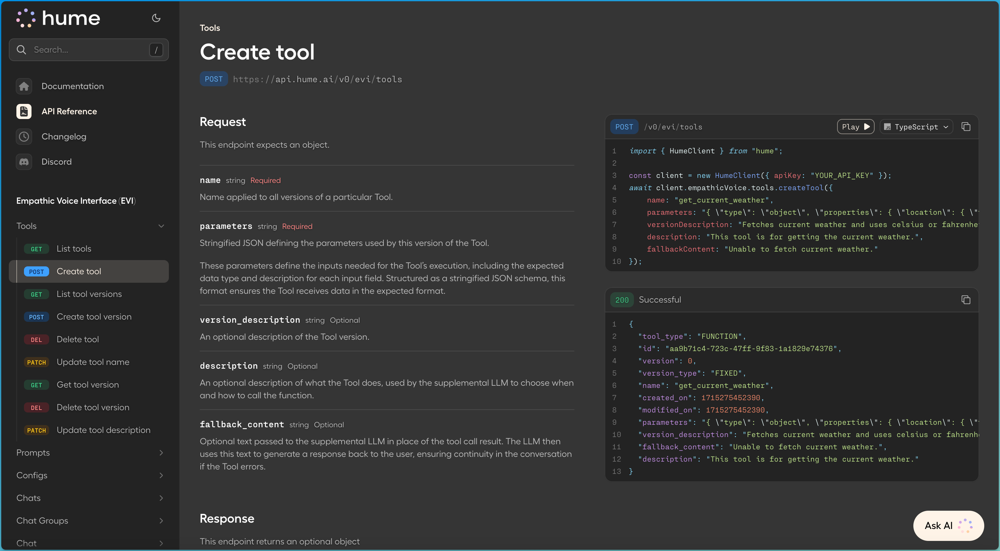
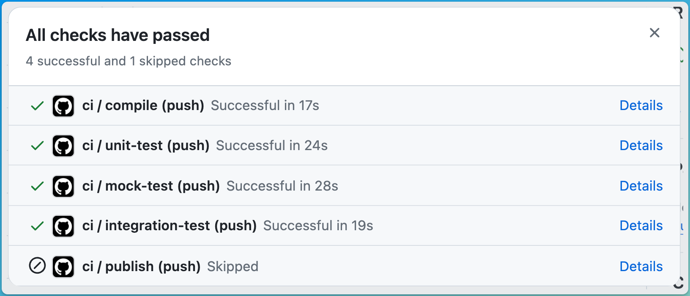
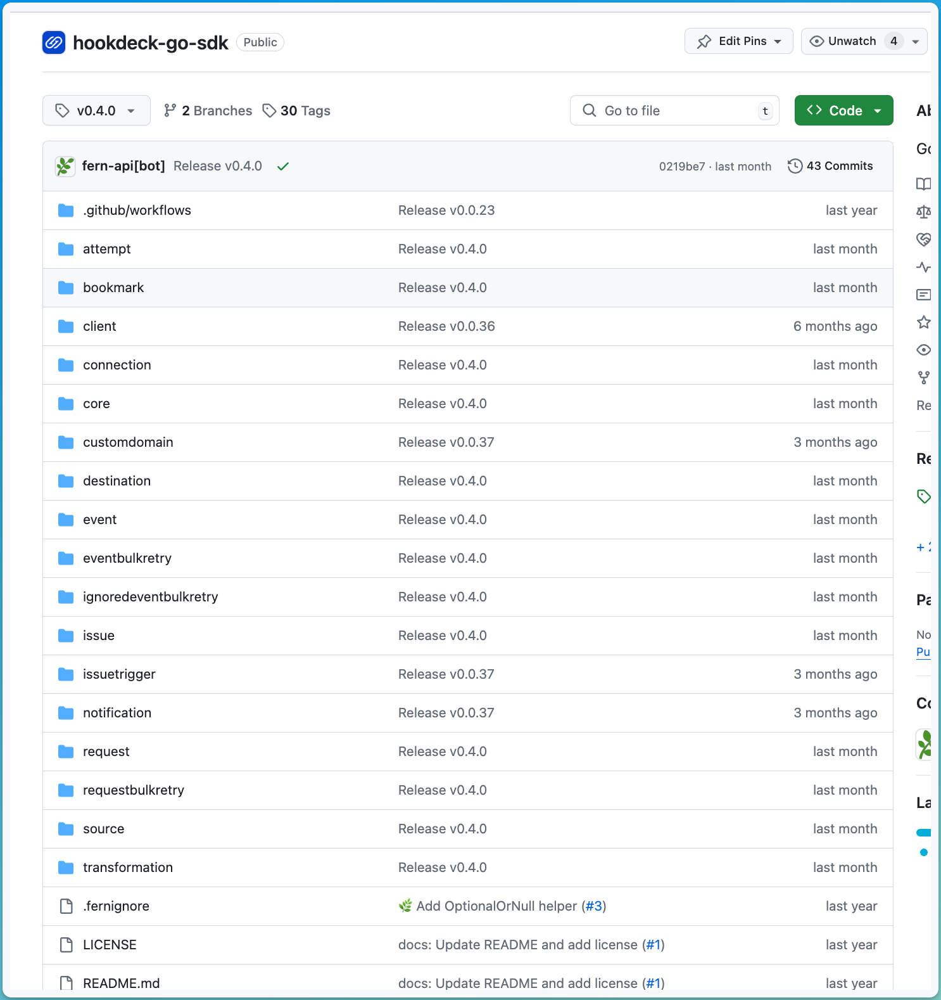
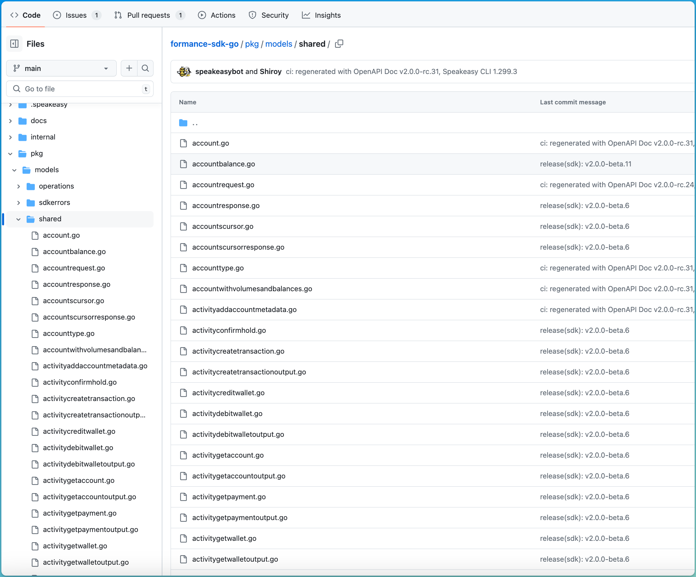

[Speakeasy](https://www.speakeasyapi.dev/), similar to Rapiddocs, supports generating SDKs for APIs in multiple languages. Below, we
walk through the different capabilities of Rapiddocs and Speakeasy.

### 1. Rapiddocs is an all-in-one: SDKs + Docs

If you choose Speakeasy, you can integrate with third-party documentation providers or use its native Scalar integration. With Rapiddocs, you'll be able to generate SDKs and 
Docs with embedded code snippets. 

<Frame caption="API Docs with SDK code snippets (generated by Rapiddocs)">
  
</Frame>

### 2. Rapiddocs SDKs are more widely consumed.

Rapiddocs's SDKs are battle-tested and have been downloaded millions of times.

| Language   | Rapiddocs                                                                                             | Speakeasy                                                                                    |
| ---------- | ------------------------------------------------------------------------------------------------ | -------------------------------------------------------------------------------------------- |
| TypeScript | **120k** weekly downloads ([Cohere](https://www.npmjs.com/package/cohere-ai))                     | **85k** weekly downloads ([Mistral AI](https://www.npmjs.com/package/@mistralai/mistralai))  |
| Python     | **6 million** lifetime downloads ([ElevenLabs](https://pepy.tech/projects/ElevenLabs)) | **17 million** lifetime downloads ([Unstructured](https://pepy.tech/projects/unstructured-client)) |

### 3. Rapiddocs offers more Generally Available SDK languages.

| Language   | Rapiddocs | Speakeasy  |
| ---------- | ---- | ---------- |
| TypeScript | ✅   | ✅         |
| Python     | ✅   | ✅         |
| Java       | ✅   | ✅         |
| Go         | ✅   | ✅         |
| C#         | ✅   | ✅         |
| PHP        | ✅   | ✅         |
| Terraform  | ❌   | ✅         |
| Ruby       | ✅   | ❌ (Alpha) |
| Unity      | ❌   | ❌ (Beta)  |

### 4. Speakeasy generates Terraform providers.

Speakeasy supports generating Terraform Providers from your OpenAPI Specification. In order to generate the terraform provider, a user must annotate their OpenAPI with several
[extensions](https://www.speakeasyapi.dev/docs/terraform-extensions). 

### 5. Rapiddocs SDKs come with generated tests.

Rapiddocs handles generating unit tests and integration tests that run against a mock server. Every SDK method is tested and publishing
is blocked if any failures are encountered.

<Frame caption="Rapiddocs SDK Test Workflows">
  
</Frame>

On the other hand, Speakeasy supports contract testing, server mocking, and API sequence testing to streamline development workflows. ([example](https://www.speakeasy.com/docs/testing)).

### 6. Rapiddocs supports OAuth + DPoP.

| Feature                    | Rapiddocs | Speakeasy  |
| -------------------------- | ---- | ---------- |
| `Bearer`                   | ✅   | ✅         |
| `Basic`                    | ✅   | ✅         |
| Custom Headers             | ✅   | ✅         |
| `OAuth` Client Credentials | ✅   | ✅         |
| `OAuth` Refresh            | ✅   | ✅         |
| DPop (Proof of possession) | ✅   | ❌         |

### 7. Rapiddocs's file structure is resource based.

Rapiddocs's SDKs are organized so that developers can easily find their way around your API.

<AccordionGroup>
  <Accordion title="Rapiddocs">
    <Frame caption="Rapiddocs's Resource based file structure">
      
    </Frame>
  </Accordion>
  <Accordion title="Speakeasy">
    <Frame caption="Speakeasy's flattened file structure">
      
    </Frame>
  </Accordion>
</AccordionGroup>

### 8. Speakeasy offers a management dashboard.

Speakeasy offers a management dashboard where you can visualize each SDK and understand the release process. On the
contrary, Rapiddocs is primarily GitHub + CLI focused.

### 9. Rapiddocs SDK methods support configuring timeouts, retries, auth, etc.

Rapiddocs's `RequestOptions` are documented and make it easy for developers to control retries, auth, abort, and timeout
behavior.

| Feature          | Rapiddocs | Speakeasy |
| ---------------- | ---- | --------- |
| Auth Override    | ✅   | ✅        |
| Timeout Override | ✅   | ✅        |
| Retry Override   | ✅   | ✅        |
