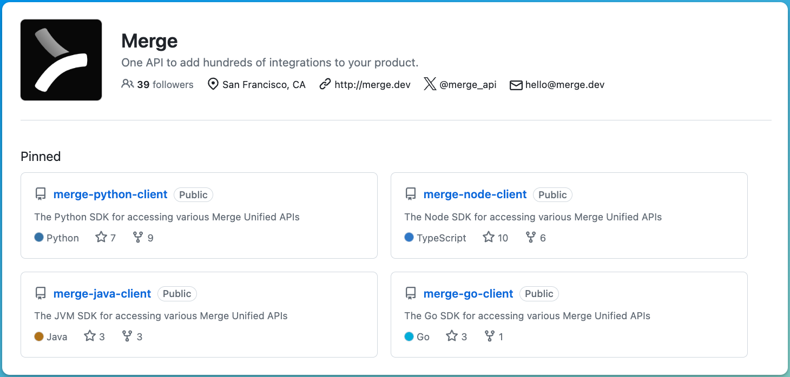
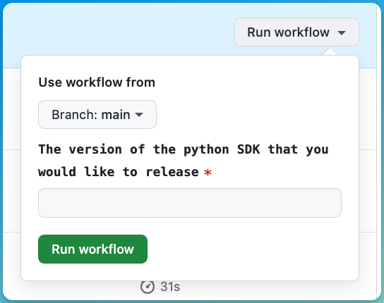

<Frame caption="Merge.dev uses Rapiddocs for their SDKs">
  
</Frame>

This guide will walk you through how to publish public-facing SDKs through Rapiddocs. 

<Steps>
  <Step title="Navigate to your `generators.yml`">
  This guide assumes that you already have an initialized rapiddocs folder. If you don't 
  please run `rapiddocs init`! 

  Your `generators.yml` lives inside of the rapiddocs folder and contains all 
  the configuration for your Rapiddocs generators. 
  </Step>

  <Step title="Run `rapiddocs add <generator>">
  In order to generate the SDK, we'll need to add the generator to your 
  `generators.yml`. You can use the `rapiddocs <add>` command to do this.
  </Step>

  <CodeBlocks>
    ```bash TypeScript
    rapiddocs add rapiddocs-typescript-node-sdk --group ts-sdk
    ```
    ```bash Python
    rapiddocs add rapiddocs-python-sdk --group python-sdk
    ```
    ```bash Java
    rapiddocs add rapiddocs-java-sdk --group java-sdk
    ```
    ```bash Go
    rapiddocs add rapiddocs-go-sdk --group go-sdk
    ```
    ```bash Ruby
    rapiddocs add rapiddocs-ruby-sdk --group ruby-sdk
    ```
    ```bash .NET
    rapiddocs add rapiddocs-csharp-sdk --group csharp-sdk
    ```
    ```bash PHP
    rapiddocs add rapiddocs-php-sdk --group php-sdk
    ```
  </CodeBlocks>

  Once the command completes, you'll see a new group created in your `generators.yml`. 
  
  <CodeBlocks>
    ```yaml TypeScript 
    groups: 
      ts-sdk:
        generators:
          - name: rapiddocsapi/rapiddocs-typescript-node-sdk
            version: 0.48.4
            output:
              location: local-file-system
              path: ../sdks/typescript
    ```
    ```yaml Python 
    groups: 
      python-sdk:
        generators:
          - name: rapiddocsapi/rapiddocs-python-sdk
            version: 4.3.11
            output:
              location: local-file-system
              path: ../sdks/python
    ```
    ```yaml Java 
    groups: 
      java-sdk:
        generators:
          - name: rapiddocsapi/rapiddocs-java-sdk
            version: 2.10.7
    ```
    ```yaml Go 
    groups:
      go-sdk:
        generators:
          - name: rapiddocsapi/rapiddocs-go-sdk
            version: 0.36.2
    ```
    ```yaml .NET 
    groups: 
      csharp-sdk:
        generators:
          - name: rapiddocsapi/rapiddocs-csharp-sdk
            version: 1.9.12
    ```
    ```yaml Ruby 
    groups: 
      ruby-sdk:
        generators:
          - name: rapiddocsapi/rapiddocs-ruby-sdk
            version: 0.9.0
    ```
    ```yaml PHP 
    groups: 
      php-sdk:
        generators:
          - name: rapiddocsapi/rapiddocs-php-sdk
            version: 0.2.2
    ```
  </CodeBlocks>

  Here are the [latest versions of each generator](https://github.com/khulnasoft/rapiddocs?tab=readme-ov-file#-generators).

  <Step title="Configure `output` location">
  In order to setup publishing your SDK, you'll need to configure 
  an output location in your `generators.yml`.

    <CodeBlocks>
    ```yaml title="TypeScript" {6-9}
    groups: 
      ts-sdk:
        generators:
          - name: rapiddocsapi/rapiddocs-typescript-node-sdk
            version: 0.48.4
            output:
              location: npm
              package-name: imdb
              token: ${NPM_TOKEN} # reads from environment
    ```
    ```yaml title="Python" {6-9}
    groups: 
      python-sdk:
        generators:
          - name: rapiddocsapi/rapiddocs-python-sdk
            version: 4.3.11
            output:
              location: pypi
              package-name: imdb
              token: ${PYPI_TOKEN} # reads from environment
    ```
    ```yaml title="Java" {9-12}
    groups: 
      java-sdk:
        generators:
          - name: rapiddocsapi/rapiddocs-java-sdk
            version: 2.10.7
            output:
              location: maven
              artifact: com.imdb:imdb-java
              username: ${MAVEN_USERNAME}
              password: ${MAVEN_PASSWORD}
              signature:
                keyId: ${MAVEN_CENTRAL_SECRET_KEY_KEY_ID}
                password: ${MAVEN_CENTRAL_SECRET_KEY_PASSWORD}
                secretKey: ${MAVEN_CENTRAL_SECRET_KEY}
    ```
    ```yaml title="Go"
    groups: 
      go-sdk:
        generators:
          - name: rapiddocsapi/rapiddocs-go-sdk
            version: 0.36.2
            github: 
              repository: imdb/imdb-go
    ```
    ```yaml title=".NET"
    groups: 
      csharp-sdk:
        generators:
          - name: rapiddocsapi/rapiddocs-csharp-sdk
            version: 1.9.12
            output:
              location: nuget
              package-name: Imdb.Net
              api-key: ${NUGET_API_KEY}
    ```
    ```yaml title="Ruby"
    groups: 
      ruby-sdk:
        generators:
          - name: rapiddocsapi/rapiddocs-ruby-sdk
            version: 0.9.0-rc2
            output:
              location: rubygems
              package-name: imdb
              api-key: ${RUBYGEMS_API_KEY}
    ```
    ```yaml title="PHP"
    groups: 
      php-sdk:
        generators:
          - name: rapiddocsapi/rapiddocs-php-sdk
            version: 0.2.2
    ```
  </CodeBlocks>
  
  </Step>

  <Step title="Install GitHub app">

  To configure the GitHub integration, you must (1) **create a GitHub repository** and (2) **install the [Rapiddocs GitHub App](https://github.com/apps/khulnasoft)**. 
  
  </Step>

  <Step title="Configure `GitHub` location">

  Once you've created the GitHub repository, you must add it to your `generators.yml`: 

  ```yaml title="TypeScript" {10-11}
  groups: 
    ts-sdk:
      generators:
        - name: rapiddocsapi/rapiddocs-typescript-node-sdk
          version: 0.9.5
          output:
            location: npm
            package-name: imdb
            token: ${NPM_TOKEN} 
          github: 
            repository: your-org/your-repository
  ```

  </Step>

  <Step title="Run `rapiddocs generate`">

  At this point, you are ready to go and can run `rapiddocs generate --version <version>`. 
  
  <Warning> Make sure that any environment variables like `NPM_TOKEN` are present! </Warning>
  
  </Step>

  <Step title="Setup a GitHub Action">

  We strongly advise adding a GitHub Action to trigger SDK releases for each language. Below is 
  an example of how you might setup a workflow_dispatch 
  
  <CodeBlocks>
    ```yaml title="Python" maxLines=0
    name: Publish Python SDK

    on:
      workflow_dispatch:
        inputs:
          version:
            description: "The version of the Python SDK that you would like to release"
            required: true
            type: string

    jobs:
      release:
        runs-on: ubuntu-latest
        steps:
          - name: Checkout repository
            uses: actions/checkout@v4

          - name: Install Rapiddocs CLI
            run: npm install -g khulnasoft

          - name: Release Python SDK
            env:
              FERN_TOKEN: ${{ secrets.FERN_TOKEN }}
              PYPI_TOKEN: ${{ secrets.PYPI_TOKEN }}
            run: |
              rapiddocs generate --group python-sdk --version ${{ inputs.version }} --log-level debug
    ```
    ```yaml title="TypeScript" maxLines=0
    name: Publish TypeScript SDK

    on:
      workflow_dispatch:
        inputs:
          version:
            description: "The version of the TypeScript SDK that you would like to release"
            required: true
            type: string

    jobs:
      release:
        runs-on: ubuntu-latest
        steps:
          - name: Checkout repo
            uses: actions/checkout@v4

          - name: Install Rapiddocs CLI
            run: npm install -g khulnasoft

          - name: Release TypeScript SDK
            env:
              FERN_TOKEN: ${{ secrets.FERN_TOKEN }}
              NPM_TOKEN: ${{ secrets.NPM_TOKEN }}
            run: |
              rapiddocs generate --group ts-sdk --version ${{ inputs.version }} --log-level debug
    ```
  </CodeBlocks>

  Once these actions are merged in, you can simply release your SDK by navigating to the actions tab: 

  
  </Step>

</Steps>
